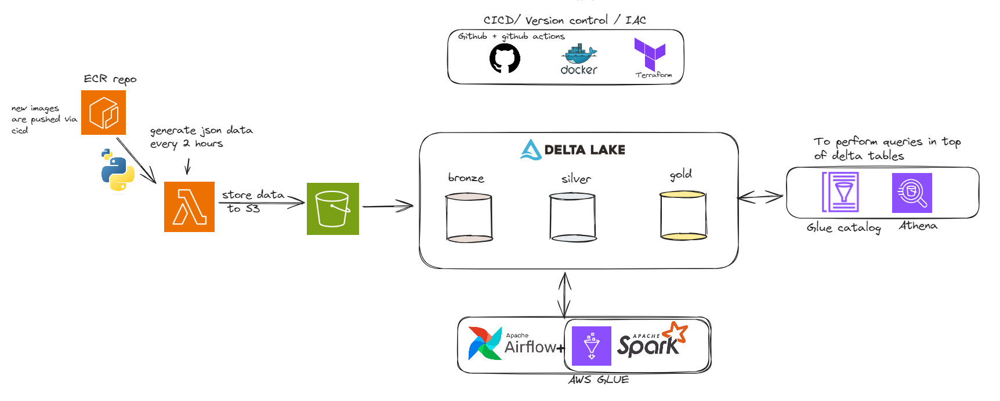
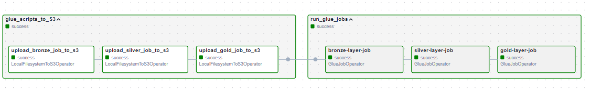

## Overview 

## Article
Check my article for more details about this project : https://medium.com/@dorianteffo/build-a-lakehouse-architecture-on-aws-using-delta-lake-and-aws-glue-in-less-than-1-week-76ce08242d92

## Summary 
The end goal of this project is to create a fully functional Lakehouse architecture using the Delta Lake table format. For this purpose, a custom Python script is deployed in AWS Lambda, responsible for generating fake data (two datasets) in the form of JSON files and saving that data to an S3 bucket.

The main data pipeline, scheduled by Airflow to run every day at 8 PM, is responsible for uploading three Python Spark (Glue) scripts to an S3 bucket and then executing those scripts. (so our tables are updated everyday)

What are these scripts in charge of doing?

* The first script, bronze_glue_script.py, is responsible for retrieving the JSON files from S3 and creating the corresponding delta tables in our Lakehouse. These tables are stored in the 'bronze' database created using Terraform.

* The second script, silver_glue_script.py, is responsible for cleaning the data stored in the delta lakes by performing various transformations to prepare it for use. The cleaned data is then saved to two tables in the 'silver' database.

* The last script, gold_glue_script.py, is responsible for generating custom reports to meet specific needs, such as player metrics by level, game metrics by genre, etc.

A key advantage of this setup is that the delta tables are automatically created in the Glue catalog. As a result, there is no need to run the crawler each time the tables are updated.

This allows us to query the data using Athena seamlessly. :)

## Airflow UI

